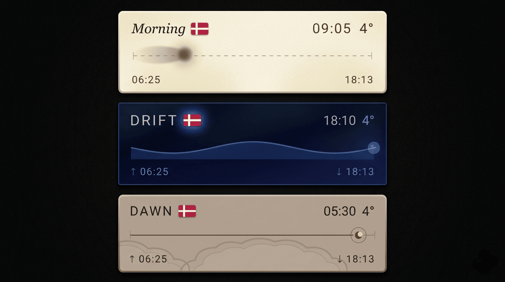

<div align="center">


<br />
<br />

<a href="https://www.npmjs.com/package/@circadian/sol">
  
</a>
<a href="https://www.npmjs.com/package/@circadian/sol">
  
</a>
<a href="https://github.com/circadian-dev/sol/blob/main/LICENSE">
  
</a>
<a href="https://github.com/circadian-dev/sol/actions/workflows/validate.yml">
  
</a>

<br />
<br />

**Solar-aware React widgets that follow the real position of the sun.**

[npm](https://www.npmjs.com/package/@circadian/sol) · [GitHub](https://github.com/circadian-dev/sol) · [circadian.dev](https://circadian.dev)

</div>

---

> **Dark mode reacts to a preference. Sol reacts to place and time.**

Most apps treat theming as a binary choice — light or dark, on or off, a toggle buried in settings.

Sol replaces that with something alive. It computes the sun's real position from the user's location, timezone, and current time, then smoothly transitions the interface through **9 solar phases** — dawn, sunrise, morning, solar noon, afternoon, sunset, dusk, night, and midnight — with animated blends, optional weather layers, and 10 richly designed skins.

No API key. No manual toggle. Your UI just follows the sun.

Sol is the flagship package from [Circadian](https://circadian.dev) — a platform for ambient-aware UI.

---

```bash
bun add @circadian/sol
# or
npm install @circadian/sol
# or (Deno / Fresh)
deno add npm:@circadian/sol
```

`@circadian/sol` gives you a full `SolarWidget`, a `CompactWidget`, 10 skins, 9 solar phases, optional live weather, optional flag display, and a dev-only timeline scrubber via `SolarDevTools`. Solar position is computed locally from latitude, longitude, timezone, and current time — no solar API required.

---

## Features

- **2 widget variants** — `SolarWidget` (full card) and `CompactWidget` (slim pill/bar)
- **10 skins** — `foundry`, `paper`, `signal`, `meridian`, `mineral`, `aurora`, `tide`, `void`, `sundial`, `parchment`
- **9 solar phases** — `midnight`, `night`, `dawn`, `sunrise`, `morning`, `solar-noon`, `afternoon`, `sunset`, `dusk`
- **4 seasons** — automatic seasonal palette blending computed from date + hemisphere, with smooth crossfades at solstice/equinox boundaries
- **Built-in fallback strategy** — geolocation → browser timezone → timezone centroid
- **Optional live weather** — powered by Open-Meteo (no API key required)
- **Dev preview tooling** — `SolarDevTools` lets you scrub through the day and preview phase colors
- **SSR-safe** — works in Next.js, Remix, TanStack Start, Blade, Fresh, and Vite

---

## Quick Start

Sol uses browser APIs for geolocation and solar computation. The exact setup depends on your framework — pick yours below.

---

### Vite

No special setup needed. Wrap your app with the provider and use widgets directly.

```tsx
// main.tsx
import { StrictMode } from 'react';
import { createRoot } from 'react-dom/client';
import { SolarThemeProvider } from '@circadian/sol';
import App from './App';

createRoot(document.getElementById('root')!).render(
  <StrictMode>
    <SolarThemeProvider initialDesign="foundry">
      <App />
    </SolarThemeProvider>
  </StrictMode>,
);
```

```tsx
// App.tsx
import { SolarWidget } from '@circadian/sol';

export default function App() {
  return <SolarWidget showWeather showFlag />;
}
```

---

### Next.js (App Router)

Add `'use client'` at the top of any file that uses Sol. This marks it as a client component and prevents it from running during server rendering.

```tsx
// components/providers.tsx
'use client';
import { SolarThemeProvider } from '@circadian/sol';

export default function Providers({ children }: { children: React.ReactNode }) {
  return (
    <SolarThemeProvider initialDesign="foundry">
      {children}
    </SolarThemeProvider>
  );
}
```

```tsx
// components/solar-widget.tsx
'use client';
import { SolarWidget } from '@circadian/sol';

export default function Solar() {
  return <SolarWidget showWeather showFlag />;
}
```

```tsx
// app/layout.tsx
import Providers from '../components/providers';

export default function RootLayout({ children }: { children: React.ReactNode }) {
  return (
    <html lang="en">
      <body>
        <Providers>{children}</Providers>
      </body>
    </html>
  );
}
```

```tsx
// app/page.tsx
import Solar from '../components/solar-widget';

export default function Page() {
  return <Solar />;
}
```

---

### Remix

Name any file that uses Sol with a `.client.tsx` extension. Remix excludes `.client` files from the server bundle automatically.

```tsx
// app/components/providers.client.tsx
import { SolarThemeProvider } from '@circadian/sol';

export default function Providers({ children }: { children: React.ReactNode }) {
  return (
    <SolarThemeProvider initialDesign="foundry">
      {children}
    </SolarThemeProvider>
  );
}
```

```tsx
// app/components/solar-widget.client.tsx
import { SolarWidget } from '@circadian/sol';

export default function Solar() {
  return <SolarWidget showWeather showFlag />;
}
```

```tsx
// app/root.tsx
import Providers from './components/providers.client';

export default function App() {
  return (
    <html lang="en">
      <body>
        <Providers>
          <Outlet />
        </Providers>
      </body>
    </html>
  );
}
```

```tsx
// app/routes/_index.tsx
import Solar from '../components/solar-widget.client';

export default function Index() {
  return <Solar />;
}
```

---

### TanStack Start

Use the `ClientOnly` component from `@tanstack/react-router` to prevent Sol from rendering during SSR.

```tsx
// app/components/solar-widget.tsx
import { ClientOnly } from '@tanstack/react-router';
import { SolarThemeProvider, SolarWidget } from '@circadian/sol';

export default function Solar() {
  return (
    <ClientOnly fallback={null}>
      <SolarThemeProvider initialDesign="foundry">
        <SolarWidget showWeather showFlag />
      </SolarThemeProvider>
    </ClientOnly>
  );
}
```

```tsx
// app/routes/index.tsx
import Solar from '../components/solar-widget';

export const Route = createFileRoute('/')({
  component: () => <Solar />,
});
```

---

### Blade

Name any file that uses Sol with a `.client.tsx` extension. Blade runs pages server-side; component files run client-side.

```tsx
// components/providers.client.tsx
import { SolarThemeProvider } from '@circadian/sol';

export default function Providers({ children }: { children: React.ReactNode }) {
  return (
    <SolarThemeProvider initialDesign="foundry">
      {children}
    </SolarThemeProvider>
  );
}
```

```tsx
// components/solar-widget.client.tsx
import { SolarWidget } from '@circadian/sol';

export default function Solar() {
  return <SolarWidget showWeather showFlag />;
}
```

```tsx
// pages/layout.tsx
import Providers from '../components/providers.client';

export default function RootLayout({ children }: { children: React.ReactNode }) {
  return <Providers>{children}</Providers>;
}
```

```tsx
// pages/index.tsx
import Solar from '../components/solar-widget.client';

export default function Page() {
  return <Solar />;
}
```

---

### Fresh (v2)

Fresh uses Preact, so Sol works via `preact/compat`. Add the React compatibility aliases to your `vite.config.ts` and `deno.json`, then create an [island](https://fresh.deno.dev/docs/concepts/islands) for the widget.

**1. Install**

```bash
deno add npm:@circadian/sol
```

**2. Configure Vite aliases** — add `resolve.alias` to `vite.config.ts`:

```ts
// vite.config.ts
import { defineConfig } from "vite";
import { fresh } from "@fresh/plugin-vite";

export default defineConfig({
  plugins: [fresh()],
  resolve: {
    alias: {
      "react": "preact/compat",
      "react-dom": "preact/compat",
      "react/jsx-runtime": "preact/jsx-runtime",
      "react/jsx-dev-runtime": "preact/jsx-runtime",
      "react-dom/client": "preact/compat/client",
    },
  },
});
```

**3. Add import map entries** — add to the `"imports"` in `deno.json`:

```jsonc
// deno.json (imports section)
{
  "imports": {
    "react": "npm:preact@^10.27.2/compat",
    "react-dom": "npm:preact@^10.27.2/compat",
    "react/jsx-runtime": "npm:preact@^10.27.2/jsx-runtime",
    "react-dom/client": "npm:preact@^10.27.2/compat/client"
  }
}
```

**4. Create an island** — islands are client-hydrated in Fresh, which is what Sol needs:

```tsx
// islands/SolWidget.tsx
import { SolarThemeProvider, SolarWidget } from '@circadian/sol';

export default function SolWidget() {
  return (
    <SolarThemeProvider initialDesign="foundry">
      <SolarWidget showWeather showFlag />
    </SolarThemeProvider>
  );
}
```

**5. Use it in a route:**

```tsx
// routes/index.tsx
import { define } from "../utils.ts";
import SolWidget from "../islands/SolWidget.tsx";

export default define.page(function Home() {
  return <SolWidget />;
});
```

---

## Provider Props

`SolarThemeProvider` is the shared runtime for solar phase computation, timezone, coordinates, and skin selection.

| Prop | Type | Default | Description |
|---|---|---|---|
| `children` | `ReactNode` | — | Required |
| `initialDesign` | `DesignMode` | `'foundry'` | Starting skin |
| `isolated` | `boolean` | `false` | Scope CSS vars to wrapper div instead of `:root`. Useful when mounting multiple providers on a single page. |

### Location is automatic

`SolarThemeProvider` resolves the user's location using a 3-step fallback:

1. **Browser Geolocation API** — most accurate, requires user permission
2. **Browser timezone** (`Intl.DateTimeFormat`) — instant, no permission needed
3. **Timezone centroid lookup** — maps the IANA timezone to approximate coordinates

Solar phases are accurate to ~15–30 minutes from timezone alone, and refine to exact values when geolocation is granted.

---

## SolarWidget

The full card widget. Reads its design from the nearest `SolarThemeProvider`.

```tsx
<SolarWidget
  expandDirection="top-left"
  size="lg"
  showWeather
  showFlag
  hoverEffect
/>
```

### Props

| Prop | Type | Default | Description |
|---|---|---|---|
| `expandDirection` | `ExpandDirection` | `'bottom-right'` | Direction the card expands |
| `size` | `WidgetSize` | `'lg'` | Widget size |
| `showWeather` | `boolean` | `false` | Enable live weather display |
| `showFlag` | `boolean` | `false` | Show country flag |
| `hoverEffect` | `boolean` | `false` | Enable hover animation |
| `phaseOverride` | `SolarPhase` | — | Force a discrete phase |
| `simulatedDate` | `Date` | — | Simulate a specific time |
| `weatherCategoryOverride` | `WeatherCategory \| null` | — | Force weather condition |
| `customPalettes` | `CustomPalettes` | — | Override phase colors per phase |
| `forceExpanded` | `boolean` | — | Lock expanded or collapsed state |

---

## CompactWidget

<div align="center">
 
 </div>

The slim pill/bar variant. Accepts an optional `design` prop to override the provider's active skin.

```tsx
<CompactWidget
  design="signal"
  size="md"
  showWeather
  showFlag
  showTemperature
/>
```

### Props

| Prop | Type | Default | Description |
|---|---|---|---|
| `design` | `DesignMode` | provider design | Design/skin override for this widget |
| `size` | `CompactSize` | `'md'` | Compact size |
| `showWeather` | `boolean` | `false` | Show weather icon |
| `showFlag` | `boolean` | `false` | Show country flag |
| `showTemperature` | `boolean` | `true` | Show live temperature |
| `overridePhase` | `SolarPhase \| null` | — | Force a discrete phase |
| `weatherCategoryOverride` | `WeatherCategory \| null` | — | Force a weather category for preview |
| `customPalettes` | `CustomPalettes` | — | Override bg gradient per phase |
| `simulatedDate` | `Date` | — | Simulate a time |
| `className` | `string` | — | Wrapper CSS class |

---

## Skins

10 designs, each with a full widget and compact variant. If `design` is omitted on `CompactWidget`, it uses the provider's active design. `SolarWidget` always uses the provider's active design.

```ts
type DesignMode =
  | 'aurora'      // luminous ethereal
  | 'foundry'     // warm volumetric industrial
  | 'tide'        // fluid organic wave
  | 'void'        // minimal negative space
  | 'mineral'     // faceted crystal gem
  | 'meridian'    // hairline geometric
  | 'signal'      // pixel/blocky lo-fi
  | 'paper'       // flat ink editorial
  | 'sundial'     // roman/classical carved
  | 'parchment';  // document strokes
```

---

## Positioning

```tsx
<SolarWidget />                                                          // inline (default)
<SolarWidget position="bottom-right" />                                  // fixed to viewport
<SolarWidget position="bottom-right" expandDirection="top-left" />       // with expand direction
```

Supported positions: `top-left` `top-center` `top-right` `center-left` `center` `center-right` `bottom-left` `bottom-center` `bottom-right` `inline`

---

## Weather

```tsx
<SolarWidget showWeather />

// Force a category for preview
<SolarWidget showWeather weatherCategoryOverride="thunder" />

// Works on CompactWidget too
<CompactWidget showWeather weatherCategoryOverride="thunder" />
```

Powered by [Open-Meteo](https://open-meteo.com/) — free, no API key. Available categories: `clear` `partly-cloudy` `overcast` `fog` `drizzle` `rain` `heavy-rain` `snow` `heavy-snow` `thunder`

---

## Phase & Time Overrides

```tsx
// Force a discrete phase
<SolarWidget phaseOverride="sunset" />

// Simulate a specific time (with blend)
const preview = new Date();
preview.setHours(6, 45, 0, 0);
<SolarWidget simulatedDate={preview} />
```

Use `simulatedDate` for realistic continuous previews. Use `phaseOverride` for simple hard overrides.

---

## Custom Palettes

Override the background gradient for any phase on any skin. Works on both `SolarWidget` and `CompactWidget`.

```tsx
<SolarWidget
  customPalettes={{
    dawn:   { bg: ['#20122a', '#7f3b5d', '#f5a66e'] },
    sunset: { bg: ['#2e0f18', '#b84a3d', '#ffbe7a'] },
  }}
/>

<CompactWidget
  customPalettes={{
    dawn:   { bg: ['#20122a', '#7f3b5d', '#f5a66e'] },
    sunset: { bg: ['#2e0f18', '#b84a3d', '#ffbe7a'] },
  }}
/>
```

Each `bg` is a 3-stop gradient: `[top, middle, bottom]`. Only the phases you specify are overridden — the rest keep the skin's default colors. All skin-specific elements (orbs, glows, text, tracks) remain unchanged; only the background gradient is replaced.

---

## Seasonal Blending

Sol automatically adjusts every skin's palette based on the current astronomical season. Spring shifts greener and brighter, summer pushes warm and saturated, autumn mutes toward amber, winter desaturates toward icy blue. The effect is subtle by design — visible but never harsh.

Season is computed from the current date and the user's latitude (southern hemisphere seasons are flipped). Near each solstice and equinox, a smooth 14-day crossfade blends between adjacent seasons.

**Zero config — it just works:**

```tsx
<SolarThemeProvider initialDesign="foundry">
  <SolarWidget showWeather showFlag />
</SolarThemeProvider>
```

**Force a season:**

```tsx
<SolarThemeProvider initialDesign="foundry" seasonOverride="autumn">
  <SolarWidget showWeather showFlag />
</SolarThemeProvider>
```

**Disable seasonal blending entirely:**

```tsx
<SolarThemeProvider initialDesign="foundry" disableSeasonalBlend>
  <SolarWidget showWeather showFlag />
</SolarThemeProvider>
```

**Read the current season in your own components:**

```tsx
import { useSolarTheme } from '@circadian/sol';

function SeasonBadge() {
  const { season } = useSolarTheme();
  return <span>{season}</span>; // 'spring' | 'summer' | 'autumn' | 'winter'
}
```

### How it works

Rather than defining 36 full palettes (9 phases × 4 seasons), each skin only needs 4 small seasonal modifier objects that describe _deltas_ — saturation scale, lightness shift, hue rotation, and an optional tint wash. The final palette is computed as:

```
rawPalette   = lerp(phasePalette, nextPhasePalette, phaseT)
seasonalMod  = lerp(seasonModifier, nextSeasonModifier, seasonT)
finalPalette = applySeasonalModifier(rawPalette, seasonalMod)
```

### Custom skin seasonal modifiers

Skins can define their own per-season modifiers. Any season not defined falls back to the built-in universal defaults.

```ts
import type { SkinDefinition } from '@circadian/sol';

const mySkin: SkinDefinition = {
  // ... existing skin definition ...
  seasonalModifiers: {
    autumn: {
      saturationScale: 0.85,   // slightly muted
      lightnessShift:  -0.05,  // darker
      hueRotateDeg:    -22,    // shift toward amber
      tintColor:       '#b85c1a',
      tintStrength:    0.12,
    },
    winter: {
      saturationScale: 0.78,
      lightnessShift:  -0.06,
      hueRotateDeg:    -30,
      tintColor:       '#6a9fc0',
      tintStrength:    0.09,
    },
    // spring and summer use UNIVERSAL_SEASON_MODIFIERS automatically
  },
};
```

### SeasonalModifier shape

| Field | Type | Description |
|---|---|---|
| `saturationScale` | `number` | Multiply saturation. `1.0` = unchanged, `1.2` = +20% |
| `lightnessShift` | `number` | Add to lightness. `-0.05` = slightly darker |
| `hueRotateDeg` | `number` | Rotate hue in degrees. `+15` = warmer, `-15` = cooler |
| `tintColor` | `string?` | Optional hex color to blend toward |
| `tintStrength` | `number` | `0–1`. How strongly to apply tintColor |

### Provider props

| Prop | Type | Default | Description |
|---|---|---|---|
| `seasonOverride` | `Season` | — | Force a specific season (`'spring'` \| `'summer'` \| `'autumn'` \| `'winter'`) |
| `disableSeasonalBlend` | `boolean` | `false` | Opt out of seasonal palette blending entirely |

---

## SolarDevTools

When your interface depends on live solar time, manual testing breaks down fast — you can't wait until sunset to test sunset. `SolarDevTools` lets you scrub through the full day in seconds, preview every one of the **9 phases**, test every skin against every time of day, and catch phase-specific visual bugs before your users do.

Imported from a dedicated subpath — never included in production bundles unless explicitly imported.

```tsx
import { SolarDevTools } from '@circadian/sol/devtools';

// Vite
{import.meta.env.DEV && <SolarDevTools />}

// Next.js / Remix / TanStack Start / Blade
{process.env.NODE_ENV === 'development' && <SolarDevTools />}
```

### Full example

```tsx
import { SolarThemeProvider, SolarWidget } from '@circadian/sol';
import { SolarDevTools } from '@circadian/sol/devtools';

export default function Demo() {
  return (
    <SolarThemeProvider initialDesign="foundry">
      <SolarWidget showWeather showFlag />
      {process.env.NODE_ENV === 'development' && (
        <SolarDevTools position="bottom-center" />
      )}
    </SolarThemeProvider>
  );
}
```

### Props

| Prop | Type | Default | Description |
|---|---|---|---|
| `defaultOpen` | `boolean` | `false` | Start expanded |
| `position` | `'bottom-left' \| 'bottom-center' \| 'bottom-right'` | `'bottom-center'` | Pill position |
| `enabled` | `boolean` | `true` | Programmatic enable/disable |

---

## useSolarTheme

```tsx
import { useSolarTheme } from '@circadian/sol';

function DebugPanel() {
  const { phase, timezone, latitude, longitude, design } = useSolarTheme();
  return (
    <pre>{JSON.stringify({ phase, timezone, latitude, longitude, design }, null, 2)}</pre>
  );
}
```

### Return shape

| Property | Type | Description |
|---|---|---|
| `phase` | `SolarPhase` | Current active phase |
| `blend` | `SolarBlend` | Phase blend state (phase, nextPhase, t) |
| `isDaytime` | `boolean` | Whether the sun is above the horizon |
| `brightness` | `number` | 0–1 brightness value |
| `mode` | `'light' \| 'dim' \| 'dark'` | Current light mode |
| `accentColor` | `string` | Active accent hex |
| `timezone` | `string \| null` | Resolved timezone |
| `latitude` | `number \| null` | Resolved latitude |
| `longitude` | `number \| null` | Resolved longitude |
| `coordsReady` | `boolean` | Whether coordinates have resolved |
| `design` | `DesignMode` | Active skin name |
| `activeSkin` | `SkinDefinition` | Full skin definition object |
| `setOverridePhase` | `(phase \| null) => void` | Set/clear phase override |
| `setDesign` | `(skin: DesignMode) => void` | Change active skin |
| `season` | `Season` | Current dominant season |
| `seasonalBlend` | `SeasonalBlend` | Season blend state (season, nextSeason, t) |
| `setSeasonOverride` | `(season \| null) => void` | Set/clear season override |

---

## Multiple Widgets

```tsx
<SolarThemeProvider initialDesign="foundry">
  <SolarWidget showWeather />
  <CompactWidget design="signal" />
  <SolarWidget />
</SolarThemeProvider>
```

`CompactWidget` accepts a `design` prop to override per-instance. `SolarWidget` always follows the provider. The provider manages shared solar state — location, phase, and weather are computed once and shared across all children.

---

## TypeScript

```ts
import type {
  DesignMode,
  SolarPhase,
  SolarBlend,
  WeatherCategory,
  ExpandDirection,
  WidgetSize,
  CompactSize,
  SkinDefinition,
  WidgetPalette,
  CustomPalettes,
  SolarTheme,
  Season,
  SeasonalBlend,
  SeasonalModifier,
} from '@circadian/sol';
```

---

## What's Included

| | |
|---|---|
| ✅ | Full widget + compact widget |
| ✅ | 10 skins with full + compact variants |
| ✅ | Automatic seasonal palette blending (4 seasons) |
| ✅ | Solar math (NOAA equations, no external API) |
| ✅ | Timezone fallback logic |
| ✅ | Optional live weather (Open-Meteo) |
| ✅ | Skin-aware country flags |
| ✅ | Dev timeline scrubber |
| ✅ | Self-contained CSS (no Tailwind required in host app) |
| ✅ | SSR-safe (Next.js, Remix, TanStack Start, Blade, Fresh, Vite) |
| ❌ | No solar API key needed |
| ❌ | No weather API key needed |
| ❌ | No Tailwind needed in your app |
| ❌ | No geolocation permission required |

---

## Coming Soon

Sol is actively being developed. Things in progress:

- More skins
- Vue and Svelte adapters
- Deep token override system

---

<div align="center">

MIT © [Circadian] - website coming soon

</div>